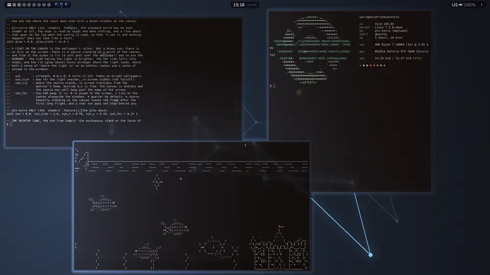
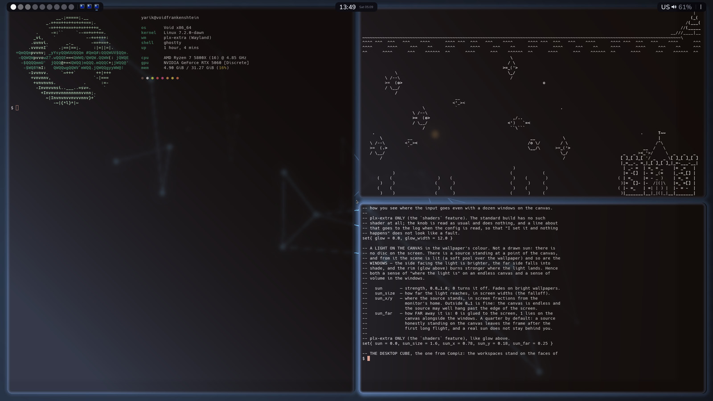
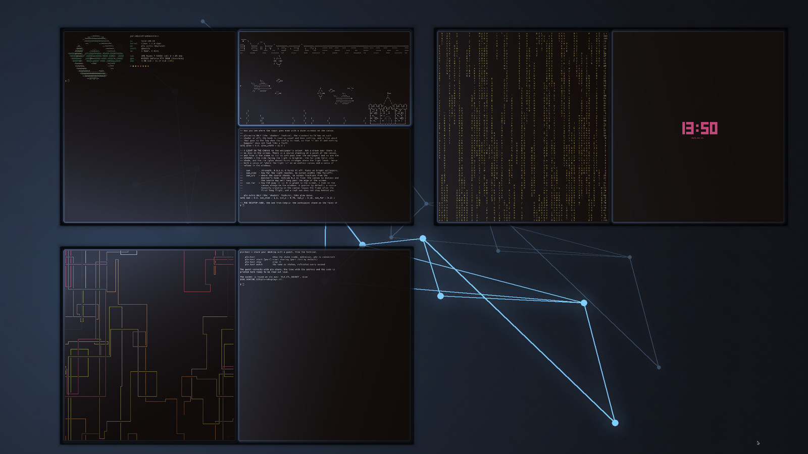
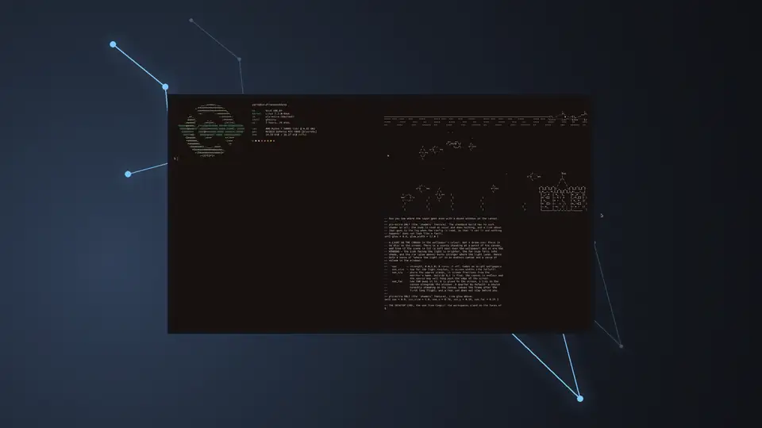

<p align="center">
  
</p>

# Parallax

<p align="center">
  <a href="https://github.com/YoungEscapist/parallax-wm/actions/workflows/ci.yml"></a>
  <a href="LICENSE"></a>
  
  
  
</p>

*[Русская версия](README.ru.md)*

A Wayland compositor where windows live on one infinite canvas and the screen is
a camera looking at it.

Most compositors give you a screen and ask how to divide it. Parallax gives you a
plane without edges. Workspaces are places on that plane, not separate worlds:
you fly to them, you can zoom out until several of them fit on screen at once,
you can pin a bookmark anywhere and jump back to it. Tiling still works — it just
happens inside a region of the canvas instead of inside your monitor.

Written in Rust on [smithay](https://github.com/Smithay/smithay), for TTY/DRM and
(for development) winit. Russian is the language of the code comments and of the
in-tree docs; this file and the config reference are in English too.

> **Status: beta — and written by a neural network.** The code, the comments,
> the documentation and the commit messages here are written by Claude
> (Anthropic's model, driven from Claude Code). The author sets the tasks, reads
> what comes back and runs the result every day: games under Xwayland, Steam,
> screen sharing, two monitors. That is the whole of the review it has had — one
> machine, one pair of human eyes and a model. So: expect rough edges, read the
> code before you trust a working session to it, and run it from a TTY you can
> escape from.

<p align="center">
  
</p>
<p align="center">
  <sub><b>The canvas.</b> The same three windows and one camera pulling away from them. The
  workspace is a place on a plane without edges, not a screen to divide; the wallpaper rides
  the canvas, and the light stands on it.</sub>
</p>

<table>
<tr>
<td width="50%"><br>
<sub><b>Tiling.</b> The dwindle split, the bar with the workspace strip, the tray and the
clock — and the focused window rim-lit in the wallpaper's own colour.</sub></td>
<td width="50%"><br>
<sub><b>Overview.</b> The workspaces exactly as they are, in a grid around the current
one; a click on one flies you there.</sub></td>
</tr>
<tr>
<td colspan="2"><br>
<sub><b>The desktop cube.</b> The same workspaces on the faces of a prism you spin by
dragging — the wheel pulls it closer, a click on a face flies to that workspace
(<code>plx-extra</code>, off by default).</sub></td>
</tr>
</table>

## What it does

**The canvas**
- One unbounded plane for every window; the output is a camera over it, with
  smooth pan, zoom and inertia.
- Zoom-nav (`Super+Space`): pull back for a bird's-eye view and pan with the
  arrow keys.
- Minimap (`Super+~`) with live window thumbnails, its own pan/zoom, and
  click-to-fly.
- Camera bookmarks: drop one anywhere (`Alt+B`), jump to it (`Super+Alt+1..9`),
  or switch to bookmark mode instead of workspaces entirely (`Super+B`).
- Overview shows the workspaces exactly as they are — floating windows stay
  floating, monocle stays monocle — because a workspace in the overview is just
  the same windows, shifted.
- Or the desktop cube from Compiz, if you want it there instead: the workspaces
  stand on the faces of a prism you spin by dragging, the wheel pulls it closer,
  a click on a face flies to that workspace, and `Super+PgUp/PgDn` turns it too.
  The prism has `cube_faces` faces while the ring behind it holds as many
  workspaces as you like, so the tenth one still meets a cube and not a
  twenty-sided wall (`set{ cube = 0.6 }`, `plx-extra` only).

**Layouts**
- `tile` — Hyprland-style dwindle (BSP): a new window splits the focused slot.
- `columns` — a niri-style scrollable strip, with tabbed columns.
- `float`, `monocle`, and per-workspace switching between all of them.
- No minimum window size: a client that refuses to shrink gets cropped in the
  renderer, so the tiling stays honest.
- Constellations: bind windows into a group that moves as one.

**The shell, built in**
- A bar with three islands: workspaces, window chips with real application
  icons, and a status side with tray (StatusNotifierItem), Wi-Fi, audio and
  Bluetooth menus.
- Hovering a window chip shows a live preview of where that window is.
- Rounded corners, drop shadows, optional background blur behind the bar,
  shelf, menus and preview cards.
- Windows can be rim-lit in the wallpaper's own colour: a shader traces the
  window edge with the accent colour Parallax reads from the palette plx-wall
  computes for the current wallpaper, so the desktop re-tints itself whenever
  the wallpaper changes. It fades out on bright wallpapers, where a coloured
  rim reads as grime, and the focused window glows twice as bright as the rest
  (`set{ glow = 0.6 }`, `plx-extra` only).
- A light that stands on the canvas rather than on the screen, lit from the same
  wallpaper colour: it pools softly over the wallpaper, the side of a window
  facing it is brighter and the far side falls into shade, and a window's shadow
  falls away from the light instead of always downwards. On a plane without
  edges it doubles as a landmark — you can tell where you are by where the light
  is (`set{ sun = 0.6 }`, `plx-extra` only).
- A quiet entrance: at startup the canvas eases out of the dark to its own zoom
  while the bar arrives from above (`set{ intro = false }` to skip it).
- A short, unobtrusive tone on every notification. Parallax hears notifications
  itself, on the session bus, so any daemon will do — mako, dunst, your own
  (`set{ notify_sound = ..., notify_volume = ... }`, see `assets/sounds/`).
- Wallpapers can live on the canvas and drift with the camera instead of being
  glued to the screen. Live (video) wallpapers come from the companion tool
  [plx-wall](https://github.com/mifaroslav-dotcom/plx-wall).

**The rest**
- Xwayland, with the pointer-clamping and hit-test fixes that games need.
- Screen sharing through an xdg-desktop-portal backend of its own, plus
  wlr-screencopy and a built-in region screenshot.
- Multi-monitor: independent workspaces, `monitor{ primary }`, drag a window
  across the edge to send it to the other screen.
- Guest sharing: show your desktop to someone else with an input seat of their
  own (`Super+Shift+S`, client: [plx-share](https://github.com/mifaroslav-dotcom/plx-share)).
- VR: put your windows on panels inside a headset over OpenXR/WiVRn
  (`Super+Alt+V`) — experimental, verified against a Monado simulator.
- Mouse chords, the model from [hevel](https://git.sr.ht/~dlm/hevel): a command
  on a *pair* of buttons pressed in sequence — hold the right button, click the
  left, release over the window you meant to close. Off by default, because the
  first button of a chord has to be held back until the second one decides
  (`mouse{}` in `default_config.lua`). The second half can be the wheel instead
  of a button — `"1-scroll"` zooms the canvas while the left button is down, and
  that pair holds nothing back — or the same button again: `"3-3"` is a double
  click, after which the window follows the cursor until you click it down.
  Resizing pulls the corner your cursor stands in, like a Super+right-drag.
- **A laptop touchscreen is a first-class input.** On a window the touch goes
  to the client as real `wl_touch`; on the bar, the window map or the overview
  the finger works as the pointer; on empty canvas it drives the camera — one
  finger pans, two pinch-zoom, three or more run the same `gesture{}` table the
  touchpad uses. A finger held still is the right button.
- Configuration is Lua, reloaded live with `Super+Shift+C`.

## Building

Rust (via rustup), pkg-config, a C compiler, and the development packages for
wayland, libxkbcommon, libinput, udev, libseat, libdrm, gbm, EGL, GLES,
libdisplay-info, PipeWire (with libspa — the screencast portal goes through it)
and pixman (smithay's renderer links `-lpixman-1`). Lua is built from source by `mlua`, so you do not need it
installed. `xwayland` is needed at runtime.

Exact package names per distribution are in the header of `build_portable.sh`;
on Void, Arch, Debian/Ubuntu and Fedora a script will install them for you:

```sh
./dist/install-deps.sh --print   # show the command it would run
sudo ./dist/install-deps.sh      # run it
./build_portable.sh              # release build: target/release/{plx-standard,plx-extra}
```

The first build pulls smithay from git (the revision is pinned in `Cargo.toml`)
and a lot of crates, so it needs a network. `Cargo.lock` is committed.

NixOS users: `shell.nix` plus `build.sh` (note that a binary linked against
Nix's glibc will segfault on a non-Nix system, and vice versa — see the comment
at the top of `build.sh`).

### Two builds

Parallax ships as two binaries, built from one crate with different feature
sets. There is no second source tree: what a feature turns off is replaced by a
stub with the same shape (`src/*_stub/`), so the calling code is identical in
both.

| | `plx-standard` | `plx-extra` |
|---|---|---|
| compositor, tiling, ribbon, overview, wallpaper | yes | yes |
| bar, tray, bluetooth, wifi, audio, portal, screenshot, X11, gestures | yes | yes |
| VR headset (`vr`) | — | yes |
| windows inside Minecraft (`mine`) | — | yes |
| multi-user desktop sharing (`share`) | — | yes |
| window glow, canvas light, desktop cube (`shaders`) | — | yes |

`plx-standard` is about 0.9 MiB smaller and does not link OpenXR. With the
optional parts off, their commands answer plainly — `vr status` says the
feature is not in this build rather than failing in some obscure way, and a
`glow`, `sun` or `cube` left in the config is read like any other setting and
answered in the log with a line saying this build has no shaders.

`shaders` is not there to save bytes — it adds no dependency and barely any
size. It is there so that `plx-standard` stays the build where every pixel takes
the shortest path to the screen.

Build one on its own with a normal cargo invocation:

```sh
cargo build --release -p plx-standard
```

Do **not** build both with a single `--workspace` command: cargo unifies
features across workspace members, and you would get two binaries that both
contain everything. `build.sh` invokes cargo twice, with separate target
directories, for exactly this reason.

## Running

Only from a **clean TTY**, with no graphical session holding DRM master
(Ctrl+Alt+F3, log in, then run it):

```sh
./launch_native.sh             # release
./launch_native.sh --debug
./launch_native.sh --winit     # nested in an existing session, for development
```

Quit with `Super+Shift+Q`, restart in place with `Super+R`. Logs land in `logs/`.

### From a display manager

To get a **Parallax** entry in ly, greetd, SDDM or GDM:

```sh
sudo ./dist/install-session.sh          # --uninstall removes both files
```

It installs exactly two files — `/usr/local/bin/parallax-session` and
`/usr/share/wayland-sessions/parallax.desktop` — and nothing else. The binary
stays in this checkout, where the build put it: the wrapper reaches it through
`launch_native.sh`, so `Super+R` and a rebuild keep pointing at the same place
instead of at a stale copy under `/usr/local/bin`.

The path to the checkout is baked into the wrapper at install time (a display
manager's `Exec=` does not go through a shell, so `$HOME` in it would not
expand); override it with `PLX_CHECKOUT`, and the install prefixes with
`BIN_DIR` and `SESSIONS_DIR`.

## Configuration

```sh
mkdir -p ~/.config/parallax
cp default_config.lua ~/.config/parallax/config.lua
```

`default_config.lua` is both the default configuration and the reference manual:
every knob is documented next to the line that sets it. It is Lua, evaluated at
startup and again on `Super+Shift+C`.

The same file in Russian is `default_config.ru.lua`: the same settings on the
same lines, comments translated. Copy that one instead if you would rather read
the manual in Russian — a test compares everything in the two files that is not
a comment, so they cannot drift apart.

A few starting points:

```lua
set{ lang = "en" }                            -- interface language: "en" or "ru"
xkb{ layout = "us,ru" }                       -- keyboard layouts, Ctrl+Space to switch
bind{ mods = "super", key = "Return",         -- your terminal
      action = "spawn", cmd = "ghostty" }
set{ blur = true }                            -- frosted glass behind the bar
set{ glow = 0.6 }                             -- rim-lit windows (plx-extra)
set{ sun = 0.6 }                              -- a light standing on the canvas (plx-extra)
set{ cube = 0.6 }                             -- workspaces on a cube (plx-extra)
set{ anim_speed = 1.0 }                       -- tempo of every animation
set{ infinite_wallpaper = true }              -- wallpaper rides the canvas
set{ notify_volume = 0.35 }                   -- loudness of the notification tone
monitor{ name = "DP-2", primary = true }
```

### Language

The interface is English by default and switches to Russian with
`set{ lang = "ru" }`, live on `Super+Shift+C`. The knob covers everything you
read on screen — the bar, the wifi/bluetooth/audio menus, the screenshot and
overview hints, notifications — and the replies of the terminal commands
(`plx-host`, the control socket).

Logs are always English and the knob does not touch them: a log ends up in
someone else's bug report, and it has to be readable by more than its author.
So is what `plx-host` says on its own behalf — its `--help` and its complaint
about finding no control socket: that one is printed exactly when there is
nobody left to ask which language you chose. What it relays from the compositor
follows the knob like everything else.

Code comments stay Russian — see the note at the top.

### Some default keys

| Key | Action |
| --- | --- |
| `Super+Return` | terminal |
| `Super+Q` | close window |
| `Super+Shift+Q` | quit the compositor |
| `Super+1..9` | go to workspace |
| `Super+Shift+1..9` | send window to workspace |
| `Super+T` / `Super+Shift+D` / `Super+Shift+M` / `Super+Shift+N` | tile / float / monocle / columns |
| `Super+Space` | zoom-nav (bird's eye) |
| `Super+~` | minimap |
| `Super+B`, `Alt+B`, `Super+Alt+1..9` | bookmark mode, drop bookmark, jump |
| `Super+F` | search windows |
| `Super+V` | float the selected window |
| `Super+Shift+C` | reload the config |
| `Super+R` | restart the compositor |

The full list — including mouse gestures, touchpad gestures and VR controller
bindings — is in `default_config.lua`.

## License

GPL-3.0-or-later. See [LICENSE](LICENSE).

Third-party notices — what Parallax is built on, what it borrows from, and what
it ships inside the binary — are in [THIRD-PARTY.md](THIRD-PARTY.md). Every
dependency is permissive (MIT / Apache-2.0 / BSD / ISC / Zlib); the parts worth
naming are [Smithay](https://github.com/Smithay/smithay) (MIT), the dwindle
algorithm ported from [Hyprland](https://github.com/hyprwm/Hyprland)
(BSD-3-Clause), the gesture model from
[driftwm](https://github.com/malbiruk/driftwm) (GPL-3.0), the mouse-chord model
from [hevel](https://git.sr.ht/~dlm/hevel) (ISC), the bundled Nunito
font (SIL OFL, text in [assets/Nunito-OFL.txt](assets/Nunito-OFL.txt)) and the
notification tones from [akx/Notifications](https://github.com/akx/Notifications)
(CC0).
