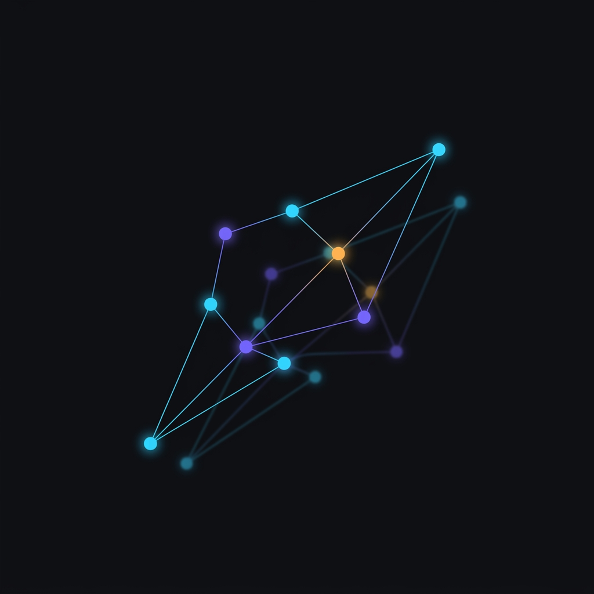

<p align="center">
  
</p>

# Parallax

<p align="center">
  <a href="https://github.com/mifaroslav-dotcom/parallax/actions/workflows/ci.yml"></a>
  <a href="LICENSE"></a>
  
  
</p>

*[In English](README.md)*

Wayland-композитор, в котором окна живут на одном бесконечном холсте, а экран —
это камера, направленная на него.

Обычно композитор даёт экран и спрашивает, как его поделить. Parallax даёт
плоскость без краёв. Рабочие столы здесь — места на этой плоскости, а не
отдельные миры: к ним летят, их видно сразу несколько, если отъехать камерой,
и в любой точке можно поставить закладку и вернуться к ней. Тайлинг никуда не
делся — он просто собирается в области холста, а не в границах монитора.

Написан на Rust поверх [smithay](https://github.com/Smithay/smithay), бэкенды —
TTY/DRM и winit (для разработки).

> **Состояние: до релиза.** Композитор используется автором каждый день — игры
> через Xwayland, Steam, демонстрация экрана, два монитора, — но смотрела на
> него ровно одна пара глаз. Шероховатости будут; запускайте с того TTY, с
> которого сможете выйти.

## Что умеет

**Холст**
- Одна бесконечная плоскость на все окна; вывод — камера над ней, с плавным
  панорамированием, зумом и инерцией.
- Лупа (`Super+Space`): отъехать и осмотреться, стрелки панорамируют холст.
- Миникарта (`Super+~`) с живыми миниатюрами окон, своим паном и зумом,
  перелёт по клику.
- Закладки камеры: поставить в любой точке (`Alt+B`), прыгнуть
  (`Super+Alt+1..9`), либо вообще перейти на закладки вместо столов
  (`Super+B`).
- Обзор показывает столы как есть: плавающие окна остаются плавающими,
  monocle — monocle, потому что стол в обзоре — это те же окна, только
  сдвинутые.

**Раскладки**
- `tile` — dwindle как в Hyprland: новое окно делит пополам слот
  сфокусированного (BSP-дерево).
- `columns` — прокручиваемая лента в духе niri, с вкладками в колонке.
- `float`, `monocle` и переключение между всеми ними по столам.
- Минимального размера окна не существует: клиент, который отказывается
  ужиматься, обрезается в рендере — тайлинг остаётся честным.
- Созвездия: связать окна в гроздь, которая ездит целиком.

**Оболочка, встроенная**
- Панель из трёх островов: столы, чипы окон с настоящими значками приложений и
  статусная часть — трей (StatusNotifierItem), Wi-Fi, звук, Bluetooth.
- Наведение на чип показывает живой предпросмотр: где это окно находится.
- Скруглённые углы, тени, размытие фона под панелью, полкой, меню и карточками
  предпросмотра.
- Спокойный вход: при запуске холст выплывает из темноты к своему зуму, панель
  приезжает сверху (`set{ intro = false }` — без него).
- Короткий ненавязчивый тон на уведомление. Уведомления parallax слышит сам, на
  сессионной шине, поэтому демон подойдёт любой — mako, dunst, свой
  (`set{ notify_sound = …, notify_volume = … }`, см. `assets/sounds/`).
- Обои могут жить на холсте и ехать за камерой, а не быть приклеенными к
  экрану. Живые (видео) обои даёт спутник [plx-wall](https://github.com/mifaroslav-dotcom/plx-wall).

**Остальное**
- Xwayland — с починенными хит-тестом и зажимом указателя, без которых игры
  промахиваются мимо кликов.
- Демонстрация экрана через свой бэкенд xdg-desktop-portal, плюс
  wlr-screencopy и встроенный снимок области.
- Несколько мониторов: свои столы на каждом, `monitor{ primary }`, перенос окна
  на соседний экран перетаскиванием через край.
- Показ рабочего стола гостю — со своим местом ввода (`Super+Shift+S`, клиент:
  [plx-share](https://github.com/mifaroslav-dotcom/plx-share)).
- VR: окна на панелях внутри шлема через OpenXR/WiVRn (`Super+Alt+V`) —
  экспериментально, проверено на симуляторе Monado.
- Настройка — Lua, перечитывается на лету по `Super+Shift+C`.

## Сборка

Нужны Rust (лучше через rustup), pkg-config, C-компилятор и dev-версии
библиотек: wayland, libxkbcommon, libinput, udev, libseat, libdrm, gbm, EGL,
GLES, libdisplay-info. Lua отдельно ставить не надо — `mlua` собирает её из
исходников. Для запуска нужен ещё `xwayland`.

Точные имена пакетов по дистрибутивам — в шапке `build_portable.sh`; для Void,
Arch, Debian/Ubuntu и Fedora их поставит скрипт:

```sh
./dist/install-deps.sh --print   # показать команду, ничего не делая
sudo ./dist/install-deps.sh      # поставить
./build_portable.sh              # release, бинари в target/release/{plx-minimal,plx-extra}
```

Первая сборка тянет smithay с гита (ревизия закреплена в `Cargo.toml`) и много
крейтов — нужен интернет; `Cargo.lock` в комплекте.

Для NixOS есть `shell.nix` и `build.sh`. Важно: бинарь, слинкованный с
Nix-glibc, падает на не-Nix системе (и наоборот) — подробности в шапке
`build.sh`.

### Две сборки

Parallax — это два бинаря из одного крейта с разными наборами фич. Второго
дерева исходников нет: то, что фича выключает, подменяется заглушкой той же
формы (`src/*_stub/`), поэтому вызывающий код в обеих сборках одинаков.

| | `plx-minimal` | `plx-extra` |
|---|---|---|
| композитор, тайлинг, лента, обзор, обои | да | да |
| панель, трей, блютуз, вайфай, звук, портал, снимок, X11, жесты | да | да |
| шлем (`vr`) | — | да |
| окна внутри Minecraft (`mine`) | — | да |
| мультиюзер, показ стола гостям (`share`) | — | да |

`plx-minimal` легче примерно на 0.9 МиБ и не линкует OpenXR. Команды
выключённых частей отвечают внятно: `vr status` говорит, что фича не собрана,
а не падает непонятным образом.

Собрать одну отдельно — обычным вызовом cargo:

```sh
cargo build --release -p plx-minimal
```

Собирать обе одной командой `--workspace` **нельзя**: cargo объединяет фичи
между членами workspace, и оба бинаря получатся полными. `build.sh` поэтому
зовёт cargo дважды, с раздельными каталогами сборки.

## Запуск

Только с **чистого TTY**, где DRM master никто не держит (Ctrl+Alt+F3, вход в
консоль):

```sh
./launch_native.sh             # release
./launch_native.sh --debug
./launch_native.sh --winit     # вложенным окном в существующем сеансе
```

Выход — `Super+Shift+Q`, перезапуск на месте — `Super+R`. Логи — в `logs/`.

### Из менеджера входа

Чтобы **Parallax** появился в списке сессий ly, greetd, SDDM или GDM:

```sh
sudo ./dist/install-session.sh          # --uninstall убирает оба файла
```

Ставится ровно два файла — `/usr/local/bin/parallax-session` и
`/usr/share/wayland-sessions/parallax.desktop`, — и больше ничего. Бинарь
остаётся в дереве исходников, куда его положила сборка: обёртка идёт к нему
через `launch_native.sh`, поэтому `Super+R` и пересборка ведут в то же место,
а не к забытой копии в `/usr/local/bin`.

Путь к дереву подставляется в обёртку при установке (`Exec=` у менеджера входа
не проходит через шелл, и `$HOME` в нём не раскрылся бы); переопределяется
переменной `PLX_CHECKOUT`, а каталоги установки — `BIN_DIR` и `SESSIONS_DIR`.

## Настройка

```sh
mkdir -p ~/.config/parallax
cp default_config.lua ~/.config/parallax/config.lua
```

`default_config.lua` — это одновременно конфиг по умолчанию и справочник: каждая
ручка описана рядом со строкой, которая её задаёт. Файл на Lua, читается при
старте и снова по `Super+Shift+C`.

С чего начать:

```lua
set{ lang = "ru" }                            -- язык интерфейса: "en" или "ru"
xkb{ layout = "us,ru" }                       -- раскладки, переключение Ctrl+Space
bind{ mods = "super", key = "Return",         -- свой терминал
      action = "spawn", cmd = "ghostty" }
set{ blur = true }                            -- матовое стекло под панелью
set{ anim_speed = 1.0 }                       -- общий темп анимаций
set{ infinite_wallpaper = true }              -- обои едут за камерой
set{ notify_volume = 0.35 }                   -- громкость тона уведомлений
monitor{ name = "DP-2", primary = true }
```

### Язык

По умолчанию интерфейс английский; `set{ lang = "ru" }` переключает на русский
на лету, по `Super+Shift+C`. Ручка накрывает всё, что читаешь глазами: панель,
меню вайфая/блютуза/звука, подсказки снимка и обзора, уведомления — и ответы
терминальных команд (`plx-host`, управляющий сокет).

Логи всегда английские, ручка их не трогает: лог попадает в чужой баг-репорт,
и разбирать его должен уметь не только автор. Комментарии в коде и доки в
дереве остаются русскими.

### Часть клавиш по умолчанию

| Клавиши | Действие |
| --- | --- |
| `Super+Return` | терминал |
| `Super+Q` | закрыть окно |
| `Super+Shift+Q` | выйти из композитора |
| `Super+1..9` | перейти на стол |
| `Super+Shift+1..9` | отправить окно на стол |
| `Super+T` / `Super+Shift+D` / `Super+Shift+M` / `Super+Shift+N` | тайлинг / float / monocle / лента |
| `Super+Space` | лупа (вид сверху) |
| `Super+~` | миникарта |
| `Super+B`, `Alt+B`, `Super+Alt+1..9` | режим закладок, поставить, прыгнуть |
| `Super+F` | поиск окон |
| `Super+V` | сделать окно плавающим |
| `Super+Shift+C` | перечитать конфиг |
| `Super+R` | перезапустить композитор |

Полный список — вместе с жестами мыши, тачпада и контроллеров VR — в
`default_config.lua`.

## Лицензия

GPL-3.0-or-later, текст — в [LICENSE](LICENSE).

Чужое — на чём Parallax стоит, у кого что перенято и что уезжает внутри
бинаря — перечислено в [THIRD-PARTY.md](THIRD-PARTY.md) вместе с требуемыми
уведомлениями. Все зависимости разрешительные (MIT / Apache-2.0 / BSD / ISC /
Zlib); отдельного упоминания стоят [smithay](https://github.com/Smithay/smithay)
(MIT), раскладка dwindle, портированная из
[Hyprland](https://github.com/hyprwm/Hyprland) (BSD-3-Clause), модель жестов из
[driftwm](https://github.com/malbiruk/driftwm) (GPL-3.0), вшитый шрифт Nunito
(SIL OFL, текст — [assets/Nunito-OFL.txt](assets/Nunito-OFL.txt)) и звуки
уведомлений из [akx/Notifications](https://github.com/akx/Notifications) (CC0).
